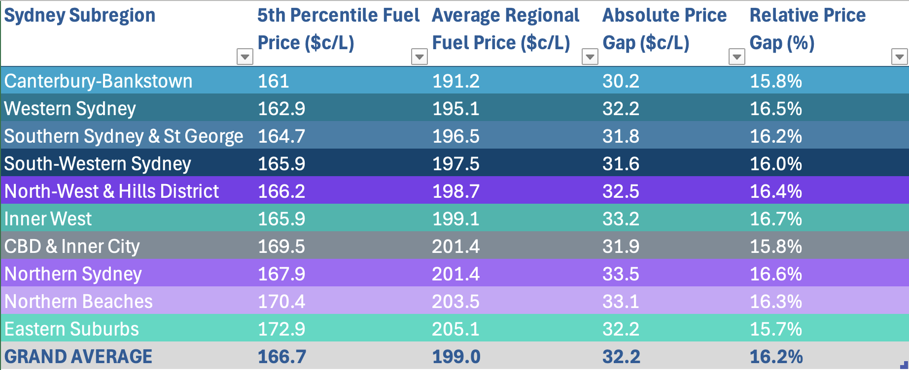
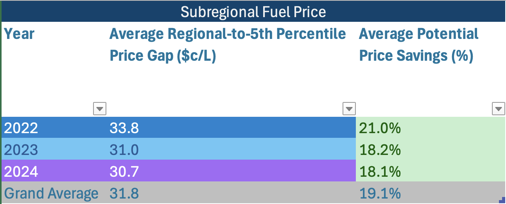

# Energy Oracle – Fuel Price Trends & Cycle Analysis in Sydney (2022–2024)

## Table of Contents

- [Project Background](#project-background)
- [Executive Summary](#executive-summary)
- [Video Demonstration of Energy Oracle App in action](#video-demonstration-of-energy-oracle-app-in-action)
- [North Star Metrics](#north-star-metrics)
  - [Timing Metrics](#timing-metrics)
  - [Pricing Metrics](#pricing-metrics)
- [Insight Deep-Dive](#insight-deep-dive)
  - [Fuel Price Distribution in Sydney (2022–2024)](#fuel-price-distribution-in-sydney-20222024)
  - [Fuel Price Trends by Quarter and Weekday](#fuel-price-trends-by-quarter-and-weekday)
  - [Fuel Price Patterns](#fuel-price-patterns)
  - [Diesel Price Behavior vs Other Fuel Types](#diesel-price-behavior-vs-other-fuel-types)
  - [Fuel Cycle Dynamics](#fuel-cycle-dynamics)
  - [Regional Fuel Price Variation Across Sydney](#regional-fuel-price-variation-across-sydney)
  - [Brand-Level Fuel Price Cycle Volatility and Year-over-Year Trend](#brand-level-fuel-price-cycle-volatility-and-year-over-year-trend)
- [Insights](#insights)
- [Recommendations for Energy Oracle App Development](#recommendations-for-energy-oracle-app-development)

***

## Project Background

Launched in 2024, **Energy Oracle** is a data-driven initiative designed to address a growing concern among Australian motorists: volatile and unpredictable fuel prices driven by global market dynamics and local supply disruptions. In high-dependency regions such as New South Wales, where millions rely on petrol-powered vehicles for daily transport, fluctuating fuel prices have led to increasing financial pressure and uncertainty around refueling decisions.

This project aims to analyze historical fuel pricing patterns, identify the underlying drivers of price cycles, and explore data-informed strategies to help consumers mitigate the impact of fuel price surges. By focusing on timing, location, and brand-specific behavior, the analysis provides actionable insights into how drivers can optimize their refueling habits.

The outcomes of this analysis support the development of the **Energy Oracle** app, a platform that leverages real-time fuel pricing data and machine learning models to forecast short-term price movements and deliver personalized alerts to users. By enabling drivers to anticipate cycle troughs and identify the most cost-effective stations nearby, the app aims to empower users with predictive insights, reduce unnecessary fuel spending, and promote more efficient, sustainable refueling behavior.

## Executive Summary

This project analyses 900k+ fuel price records collected across New South Wales between 2022 and 2024, with a focused lens on the Sydney metropolitan area, where fuel pricing exhibits both short-term cyclical behavior and long-term market trends. The insights serve as a foundation for developing Energy Oracle, a predictive app aimed at helping users optimize their refueling decisions and reduce fuel expenses.
Key findings include:

### Consistent Fuel Cycle Timing
Sydney’s fuel prices follow a predictable short-term cycle, averaging 5.9 weeks in duration. Despite occasional market shocks (e.g., in 2022), the cycle structure remains intact—providing a reliable basis for forecasting.

### Weekly Price Trends
The average fuel price across the three years is 196.9c/L, with cycles showing an average price uplift of 10.2% from trough to peak. This fluctuation highlights a valuable opportunity for consumers to save by timing their purchases.

### Localized Savings Opportunities
By identifying and targeting the lowest 5th percentile of fuel stations within each Sydney subregion, users can achieve a consistent saving of 16.2%, regardless of geographic area. This reflects stable price gaps across districts, driven by local operating costs rather than price volatility.

### Brand-Based Volatility Patterns
Analysis reveals that certain fuel brands exhibit lower price volatility, while others swing sharply across cycles. This enables smart brand-switching strategies, allowing users to refuel with stable brands during peak pricing periods and switch to highly variable brands at troughs.

### Strategic Brand and Location Switching
By combining subregional targeting with alternating brand-based strategies, users have the potential to reduce average refueling costs by up to 24.7%, making a strong case for personalized, predictive refueling recommendations.

### Price Lock Mechanism Integration
Inspired by 7-Eleven’s model, a one-week price lock feature is recommended. When used in conjunction with trough forecasts, this allows users to secure low prices before market rebounds, further maximizing cost efficiency and offering a unique value proposition within the fuel app ecosystem.

Based on the key insights uncovered throughout this analysis, a prototype of the Energy Oracle application has been developed to demonstrate its potential functionality and user experience. This prototype highlights how real-time data and predictive analytics can be leveraged to help users make smarter refueling decisions. 

## Video Demonstration of Energy Oracle App in action

## North Star Metrics 
The following core metrics serve as the analytical foundation for the Energy Oracle app, guiding fuel price prediction, refueling optimization, and long-term savings strategies.

### Timing Metrics

**Cycle Duration** - Represents the average duration (in weeks) of a full fuel price cycle (from peak to peak)

**Cycle Duration Volatility (Standard Deviation)** - Measures the consistency of cycle durations across time

**Optimal Refuel Day** - Identifies the day of the week with the lowest average fuel price. This metric enables weekday-based refueling recommendations, maximizing everyday savings for users.

### Pricing Metrics

**Weekly Average Market Price** - Captures the market-wide baseline price of fuel each week

**5th Percentile Price (Lowest Local Price)** - Indicates the lowest-priced 5% of fuel stations each week. This metric serves as a benchmark for price competitiveness and supports recommendations for hyperlocal savings opportunities.

**Cycle Price Swing** - Measures the average price difference between trough and peak within a fuel price cycle. This metric defines the magnitude of potential savings when timing refueling strategically.

**Cycle Price Swing Variability (Standard Deviation)** -  Quantifies the variability of the cycle range over time.

***

## Insight Deep-Dive

### Fuel Price Distribution in Sydney (2022–2024)

- Over the 2022–2024 period, the average fuel price in Sydney was 196.9 cents per litre ($c/L), while the lower 5th percentile of prices averaged $164.6c/L.

- This represents a consistent 16.5% cost advantage for consumers who refuel at the most competitively priced stations.

### Fuel Price Trends by Quarter and Weekday

Click the image below to access the interactive Tableau dashboard: 

- Fuel prices in Sydney from 2022 to 2024 exhibit a clear seasonal trend, marked by a clear upward trend in Sydney fuel prices is observed from Q3 2023 to Q2 2024, with consistent increases across all weekdays. This reverses in Q3 2024, marking the start of a broader price decline and potential market correction.

- Across 2022–2024, Sunday consistently records the lowest average fuel prices, occasionally followed by Saturday,  indicating that early-week refueling offers better cost savings.

### Fuel Price Patterns
Click the image below to access the interactive Tableau dashboard: 

- Superimposed on this seasonal pattern is a consistent short-term price cycle, characterized by periodic peaks and troughs. These short cycles average 5.9 weeks in duration and remain relatively stable across all three years, indicating a predictable structure in consumer fuel pricing.

- The Average Fuel Cycle Duration remained steady at 6.1 weeks in both 2022 and 2023, before declining to 5.5 weeks in 2024, representing a 10.2% year-over-year decrease.

- In 2022, external global market factors contributed to greater volatility, with a Cycle Duration Variability of 1.7 weeks (standard deviation). However, this volatility reduced to 1.1 weeks by 2024, reflecting a 30.8% year-over-year decline and indicating a stabilizing market cycle structure.

### Diesel Price Behavior vs Other Fuel Types

Click the image below to access the interactive Tableau dashboard:

- While most fuel types (U91, P95, P98, E10) exhibit regular and synchronized fuel price cycle durations, typically repeating every 6 to 8 weeks. Diesel (DL) demonstrates a markedly different pattern.

- Diesel prices follow a significantly longer and smoother cycle, showing less sensitivity to short-term surges observed across petrol-based fuels but remains aligned with long-term market direction over the three-year period.

### Fuel Cycle Dynamics

Click the image below to access the interactive Tableau dashboard: 

- Sydney's fuel market exhibited an Average Cycle Price Swing of $19.0c/L, representing a 10.2% increase from trough to peak within each cycle.

- In 2022, the market experienced heightened volatility with a Cycle Price Swing Variability of 8.8 St. Dev., largely driven by global external factors.

- However, this volatility decreased significantly in subsequent years, falling by 57.6% in 2023 and a further 22.9% in 2024, indicating a progressive stabilization of intra-cycle price swings across the market.

### Regional Fuel Price Variation Across Sydney

Click the image below to access the interactive Tableau dashboard: 

- Average fuel prices across Sydney subregions range from $191.2c/L in Canterbury-Bankstown to $205.1c/L in the Eastern Suburbs, with the highest prices concentrated in the Northern and Eastern districts, and the lowest prices found in Western and Southern regions.

- Despite this geographic variation, the Absolute Price Gap between the average and the lower 5th percentile stations remains consistently stable, averaging $32.2c/L across all subregions, with less than 1% variation. This suggests a uniform opportunity for savings across regions for consumers who actively seek out the lowest-priced stations.

- This translates to a potential average saving of 19.1% for consumers who refuel at the most competitively priced stations within their local area , which reinforces the value of price-aware refueling behavior across all subregions.

### Brand-Level Fuel Price Cycle Volatility and Year-over-Year Trend

- While most fuel brands follow the broader fuel price cycle, the magnitude of cycle price swing varies significantly by brand, ranging from $11.4c/L (Costco) to $24.0c/L (Coles Express).

- Notably, Costco and Mobil, the two brands with the lowest overall cycle price swing, experienced substantial reductions in price variability starting in 2023, with further contraction in 2024.

- In contrast, most other brands saw a sharp decline in cycle price swing during 2023, followed by a modest rebound or stabilization in 2024, indicating a partial return to more typical cycle behavior.

Click the image below to access the interactive Tableau dashboard: 

- Analysis of weekly price trends in 2023 reveals that consumers can improve fuel savings by alternating between brands with different price fluctuation profiles.

- For example, switching between Budget (a high-volatility brand) and Mobil (a low- volatility brand) allows drivers to capitalize on Budget's lower prices during troughs, while avoiding price spikes by refueling with Mobil during peak periods.

- This brand-switching strategy offers a practical way to mitigate price surges and maintain lower average fuel costs throughout the year.

***

## Insights
Sydney's fuel price landscape reveals a clear seasonal trend, overlaid with predictable short-term cycles that remain consistent across years. In relatively stable market conditions, such as in 2024, both cycle duration and intra-cycle price fluctuations remained uniform, with average cycle length stabilizing around 5.9 weeks and price shifts averaging $19c/L. Sunday consistently offers the lowest prices, making it a key temporal anchor for prediction and alerts.

Even during volatile periods like 2022, impacted by global market shocks, the overall periodicity persisted, though accompanied by greater volatility in cycle range and duration. This demonstrates the resilience of Sydney’s fuel pricing structure, making it suitable for cycle-based forecasting.

Despite notable differences in average fuel prices across Sydney subregions (ranging from $191.2c/L to $205.1c/L), the price gap between the average and the lower 5th percentile stations remains consistently around $32c/L in all areas. This suggests regional price differences stem largely from local operational costs (e.g., rent, logistics) rather than pricing volatility, supporting the use of uniform savings models across regions and hyperlocal prediction models tied to the user’s district and preferred brands.

By alternating fueling with different fuel brand during peak and trough season and combining with a one-week price lock mechanism, end users have the potential to reduce their average refueling expenses by up to 24.7%

***

## Recommendations for Energy Oracle App Development
### Incorporate Diesel as a Long-Term Market Indicator
Diesel prices display less volatility and slower response to cycle peaks. As a result, Diesel can serve as a benchmark for long-term trend forecasting, guiding baseline model adjustments over broader time horizons.

### Implement Subregional Smart Station Suggestions
Leverage the consistent price gap between subregional averages and their 5th percentile lows to surface hyperlocal, lowest-price station alerts. This can help users make cost-effective fueling decisions regardless of their location, especially in areas where price variation is otherwise high.

### Enable Brand Switching Strategy Based on Volatility
Fuel brands show distinctive fluctuation patterns—e.g., Budget, Coles Express (high volatility) and Mobil, Costco (low volatility). By analyzing brand-specific cycles, the app can advise users to alternate refueling behavior:
- Use high-fluctuation brands during troughs for the lowest possible prices
- Shift to low-fluctuation brands during peaks to avoid price spikes
This hybrid fueling strategy minimizes user exposure to volatile price cycles.

### Incorporate Price Locking Simulation for Savings Forecasting
Drawing inspiration from 7-Eleven’s price-lock feature, Energy Oracle could model optimal refueling windows and simulate potential savings if users act on forecasted trough prices. This adds a practical, action-oriented layer to forecasts, encouraging users to lock in prices when cost savings are projected to be highest.

*** 

- All the data cleaning and preprocessing are documented in [Python Juypter Notebook](Data_preprocessing/).
- Data exploration, analysis and findings are avaliable on [Tableau Public](https://public.tableau.com/views/WeeklyFuelPriceTrendandCycleAnalysisinSydney2022-2024/WeeklyFuelPriceTrendandCycleAnalysisinSydney2022-2024?:language=en-GB&:sid=&:redirect=auth&:display_count=n&:origin=viz_share_link), with supporting workbooks provided in [Tableau and Excel formats](Data_exploration/).
